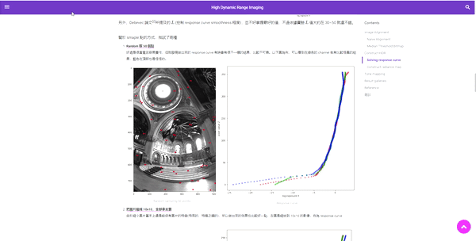

# Hexo Photo Zoom 


<p style="text-align: center; font-weight:700;">
A hexo tag plugin for image zooming, with a zooming effect similar to Medium.
</p>

<div style="text-align:center"></div>

_This plugin use zoom.js created by [@fat](https://github.com/fat/zoom.js) and [@nishanths](https://github.com/nishanths/zoom.js)_


## Usage

```

```

<!-- More detail usage please see the [Demo]() -->

```yaml
# in _config.yaml

photozoom:
    enable: true
    # Lower priority means that it will be executed first.
    priority: 10
    # Show caption at the bottom of photo, default is "true"
    caption: true
    # Class name of caption, default is "zoom-initial-caption"
    caption_class: 'my-caption' 
```

