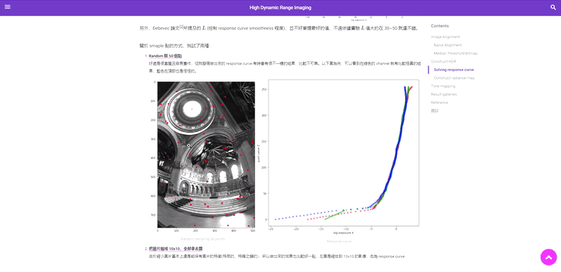

# Hexo Photo Zoom 

<p style="text-align: center; font-weight:700;">
A hexo tag plugin for image zooming, with a zooming effect similar to Medium.
</p>

<div style="text-align:center"></div>

_This plugin use zoom.js created by [@fat](https://github.com/fat/zoom.js) and [@nishanths](https://github.com/nishanths/zoom.js)_


## Usage

```

```

## Config

```yaml
# in _config.yaml

photozoom:
    enable: true
```

